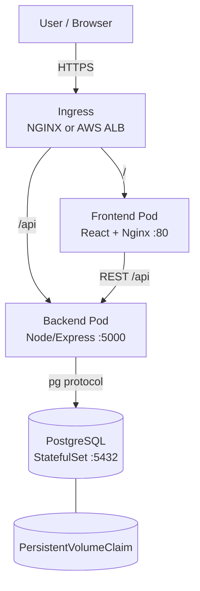
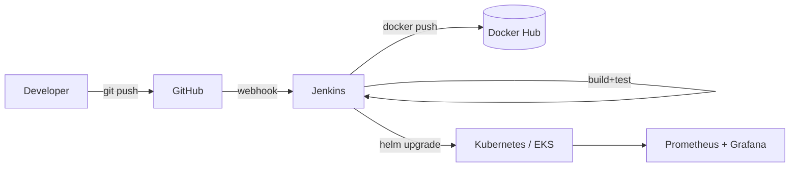
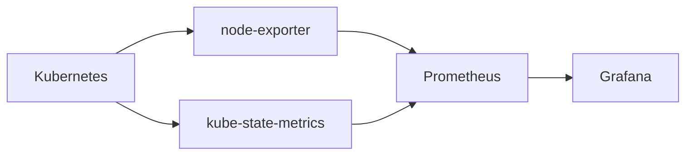
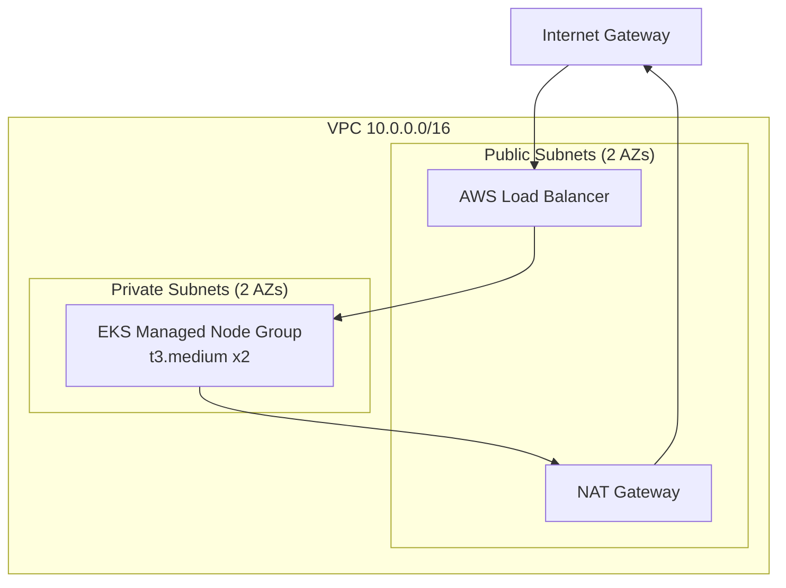

# ShopKart — 3-Tier E-Commerce DevOps Project

> A production-style 3-tier e-commerce application (Frontend → Backend API → PostgreSQL) built end-to-end to demonstrate a complete DevOps lifecycle: **Git → GitHub → Jenkins → Docker → Docker Hub → Kubernetes → Helm → AWS EKS → Prometheus/Grafana**.

This is a **portfolio + interview project**. It is designed so the *same* application code runs on:

1. **Laptop** (Vite dev server + Node dev server + local Postgres)
2. **Docker Compose** (three containers on one host)
3. **Killercoda Kubernetes** (free playground, no AWS required)
4. **AWS EKS** (real cloud, provisioned with Terraform)

No copyrighted branding, logos, or code from any real e-commerce company is used. All products, categories, and images are fictional.

---

## Table of Contents

- [1. Project Overview](#1-project-overview)
- [2. Architecture](#2-architecture)
- [3. Features](#3-features)
- [4. Technology Stack](#4-technology-stack)
- [5. Repository Structure](#5-repository-structure)
- [6. Prerequisites](#6-prerequisites)
- [7. Local Setup](#7-local-setup)
- [8. Docker Setup](#8-docker-setup)
- [9. Docker Compose](#9-docker-compose)
- [10. GitHub](#10-github)
- [11. Jenkins CI/CD](#11-jenkins-cicd)
- [12. Kubernetes](#12-kubernetes)
- [13. Killercoda](#13-killercoda)
- [14. Helm](#14-helm)
- [15. AWS + EKS + Terraform](#15-aws--eks--terraform)
- [16. Monitoring](#16-monitoring)
- [17. Security](#17-security)
- [18. Troubleshooting](#18-troubleshooting)
- [19. Cleanup](#19-cleanup)
- [20. Interview Preparation](#20-interview-preparation)
- [21. License](#21-license)

---

## 1. Project Overview

**ShopKart** is a fictional online marketplace where users can browse products across categories such as Mobiles, Laptops, Electronics, Fashion, Home Appliances, Books, and Accessories. Users can register, log in, search, filter, add items to a cart or wishlist, checkout through a **simulated payment** flow, and view order history. Admins can manage products, inventory, categories, orders, and users through an admin dashboard.

The **application is realistic** enough to be interviewable, and **small enough** to deploy on a free Killercoda Kubernetes cluster before moving to AWS EKS.

### Why this project exists

| Goal | How ShopKart delivers it |
|---|---|
| Show 3-tier separation | React SPA ↔ Express REST API ↔ PostgreSQL |
| Show containerization | Multi-stage Dockerfiles for both app tiers |
| Show local orchestration | `docker-compose.yml` with healthchecks + volumes |
| Show CI/CD | Jenkins Declarative Pipeline + GitHub webhook |
| Show Kubernetes | Raw manifests **and** a Helm chart |
| Show cloud | Terraform-provisioned VPC + EKS + managed node group |
| Show observability | kube-prometheus-stack + custom app metrics |
| Show DevSecOps | Trivy scan, non-root containers, secrets, RBAC |

---

## 2. Architecture

### 2.1 Application (Runtime) Architecture



### 2.2 DevOps / Delivery Pipeline



### 2.3 Monitoring



### 2.4 AWS Infrastructure (Phase 11–12)



---

## 3. Features

### 3.1 User Features

- Register / Login / Logout
- Profile management
- Browse products by category
- Search products
- Filter products (price, rating, availability)
- Product details page
- Add / remove / update cart
- Wishlist
- Address management
- Checkout with **simulated payment**
- Order history and details
- Order status tracking
- Product reviews and star ratings

### 3.2 Admin Features

- Admin login (role-gated)
- Dashboard with basic sales metrics
- Create / update / delete products
- Manage inventory (stock levels)
- Manage categories
- View users
- View orders
- Update order status

### 3.3 Mock Payment Flow

```
Cart  →  Checkout  →  Mock Payment (always "succeeds")  →  Order Created  →  Confirmation
```

> **Note:** This is a **simulated payment system**. No real payment gateway is integrated. The `payments` table records the mock transaction for realism.

---

## 4. Technology Stack

| Layer | Technology |
|---|---|
| Frontend | React 18 + Vite + React Router + Axios + Nginx |
| Backend | Node.js 20 + Express + JWT + bcrypt + `pg` |
| Database | PostgreSQL 15 |
| Containers | Docker (multi-stage), Docker Compose |
| CI/CD | Jenkins (Declarative Pipeline) + GitHub Webhook |
| Registry | Docker Hub |
| Orchestration | Kubernetes (Killercoda → AWS EKS) |
| Packaging | Helm 3 |
| IaC | Terraform (AWS provider) |
| Monitoring | Prometheus + Grafana (`kube-prometheus-stack`) |
| Security | Trivy, non-root containers, K8s Secrets, RBAC |

---

## 5. Repository Structure

```
shopkart-3tier-devops/
├── frontend/            # React + Vite SPA
├── backend/             # Node/Express REST API
├── database/            # schema.sql, seed.sql, migrations/
├── docker/              # postgres + nginx helper configs
├── k8s/                 # raw Kubernetes manifests
├── helm/shopkart/       # Helm chart
├── jenkins/             # Jenkins image + casc config
├── terraform/           # AWS VPC + EKS provisioning
├── monitoring/          # Prometheus + Grafana values + dashboards
├── scripts/             # helper scripts
├── tests/               # smoke + load tests
├── docs/                # deep-dive documentation
├── docker-compose.yml
├── Jenkinsfile
├── .gitignore
├── .dockerignore
├── .env.example
├── LICENSE
└── README.md
```

---

## 6. Prerequisites

| Tool | Version |
|---|---|
| Git | ≥ 2.30 |
| Node.js | ≥ 20 |
| npm | ≥ 10 |
| Docker | ≥ 24 |
| Docker Compose | v2 (`docker compose`) |
| kubectl | ≥ 1.28 |
| Helm | ≥ 3.13 |
| Terraform | ≥ 1.6 |
| AWS CLI | v2 |

---

## 7. Local Setup

```bash
git clone https://github.com/<your-user>/shopkart-3tier-devops.git
cd shopkart-3tier-devops

cp .env.example .env
cp frontend/.env.example frontend/.env
cp backend/.env.example backend/.env
```

Then run frontend and backend separately (Phase 2 & 3 will provide scripts).

---

## 8. Docker Setup

- **Frontend image:** multi-stage `node:20-alpine` → `nginx:alpine`
- **Backend image:** `node:20-alpine` with non-root user
- Both images are small and non-root.

---

## 9. Docker Compose

```bash
docker compose up -d          # start stack
docker compose ps             # list services
docker compose logs -f        # follow logs
docker compose down           # stop, keep volume
docker compose down -v        # stop, delete volume (wipes DB)
```

Service names: `frontend`, `backend`, `postgres`.

---

## 10. GitHub

```bash
git init
git add .
git commit -m "chore: initial commit"
git branch -M main
git remote add origin https://github.com/<your-user>/shopkart-3tier-devops.git
git push -u origin main
```

**Never commit:** GitHub PAT, AWS keys, Docker Hub password, JWT secret, production DB password.

---

## 11. Jenkins CI/CD

Pipeline stages:

```
Checkout → Install → Lint → Test → Build FE → Build BE →
Docker Build → Image Scan (Trivy) → Push → Deploy → Verify
```

Credentials required in Jenkins (see Phase 7):

- `dockerhub-creds` (Username/Password)
- `kubeconfig-creds` (Secret file)
- `github-webhook-secret` (Secret text)

---

## 12. Kubernetes

Raw manifests under `k8s/`. Objects:

- Namespace `shopkart`
- ConfigMap + Secret
- Frontend Deployment + Service
- Backend Deployment + Service
- Postgres StatefulSet + Service + PVC
- Ingress
- HPA

All containers use readiness / liveness / startup probes and resource requests/limits.

---

## 13. Killercoda

Full runnable guide is in [`docs/KILLERCODA.md`](docs/KILLERCODA.md). It uses only a plain Kubernetes playground — no AWS.

---

## 14. Helm

```bash
helm lint helm/shopkart
helm template shopkart helm/shopkart
helm install shopkart helm/shopkart -n shopkart --create-namespace
helm upgrade shopkart helm/shopkart -n shopkart
helm rollback shopkart 1 -n shopkart
helm uninstall shopkart -n shopkart
```

Environment overlays: `values-dev.yaml`, `values-prod.yaml`.

---

## 15. AWS + EKS + Terraform

```bash
cd terraform
terraform init
terraform validate
terraform plan -out=tfplan
terraform apply tfplan

aws eks update-kubeconfig --region us-east-1 --name shopkart-eks
kubectl get nodes
helm upgrade --install shopkart helm/shopkart -n shopkart --create-namespace
```

Full guide: [`docs/AWS-EKS.md`](docs/AWS-EKS.md) and [`docs/TERRAFORM.md`](docs/TERRAFORM.md).

---

## 16. Monitoring

```bash
helm repo add prometheus-community https://prometheus-community.github.io/helm-charts
helm repo update
helm install kube-prom prometheus-community/kube-prometheus-stack \
  -n monitoring --create-namespace \
  -f monitoring/values-prometheus.yaml
```

Grafana dashboards are version-controlled in `monitoring/dashboards/`.

---

## 17. Security

- Non-root containers
- Multi-stage builds → minimal runtime images
- Trivy image scan in Jenkins (fails pipeline on CRITICAL)
- Kubernetes Secrets for DB password + JWT secret
- Jenkins Credentials for all registry / cluster / cloud auth
- JWT + bcrypt for auth
- Input validation on all write endpoints
- RBAC + least-privilege IAM for EKS

---

## 18. Troubleshooting

Full guide: [`docs/TROUBLESHOOTING.md`](docs/TROUBLESHOOTING.md).

Covers: `ImagePullBackOff`, `CrashLoopBackOff`, Pending pods, DB connection failure, Ingress failures, PVC Pending, probe failures, Jenkins / Docker / Terraform errors.

---

## 19. Cleanup

**Local:**

```bash
docker compose down -v
```

**Killercoda:**

```bash
kubectl delete namespace shopkart
```

**AWS:**

```bash
cd terraform
terraform destroy
```

See [`docs/AWS-EKS.md`](docs/AWS-EKS.md) for details on ensuring no orphaned load balancers.

---

## 20. Interview Preparation

See [`docs/INTERVIEW-QUESTIONS.md`](docs/INTERVIEW-QUESTIONS.md) for 20 beginner + 20 intermediate + 20 advanced questions with answers, all tied to this project.

---

## 21. License

MIT — see [LICENSE](LICENSE).
